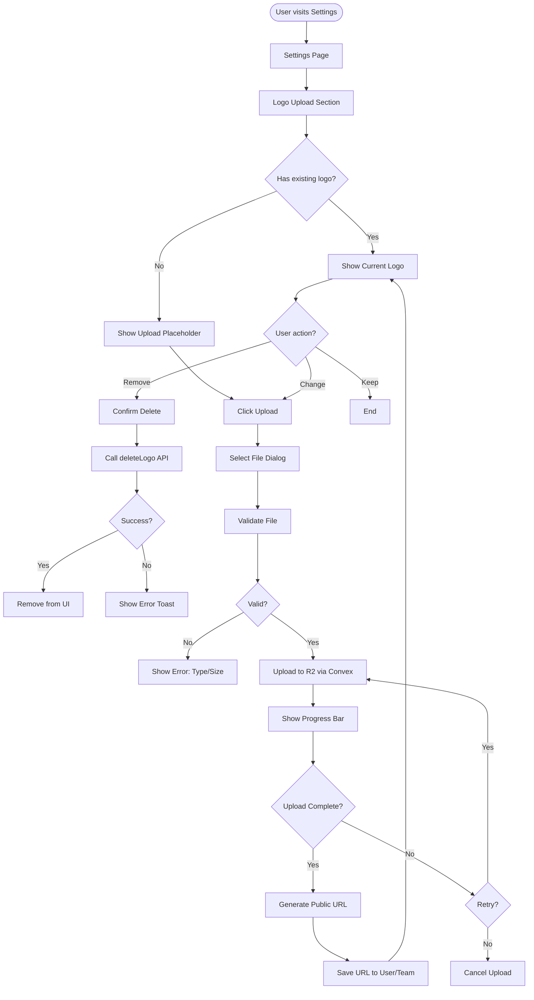
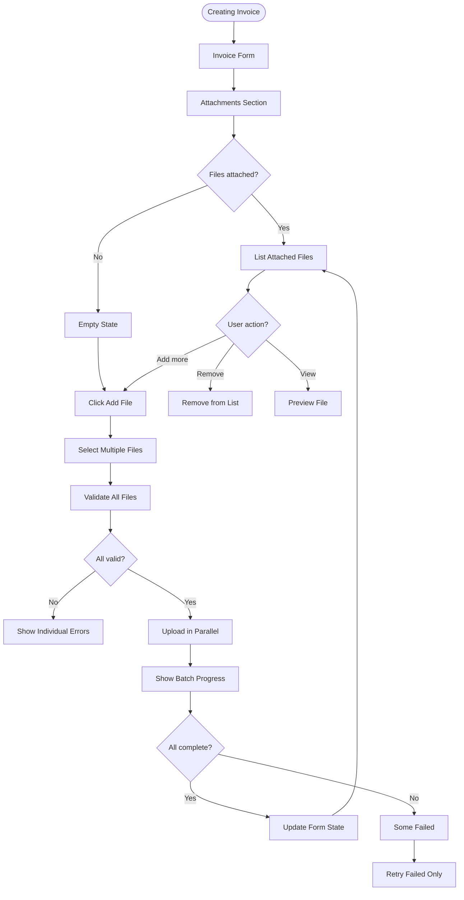
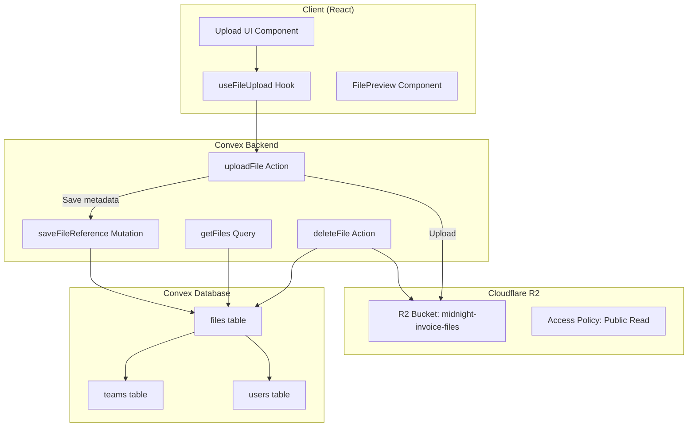

# Feature Spec: Cloudflare R2 File Storage

**Spec ID**: PLAN-001  
**Type**: Feature Spec  
**Status**: Draft  
**Created**: Feb 8, 2026 at 9:46 AM  
**Coding Agent**: Kimi Code CLI  
**Chat Reference**: `.gemini/conversations/2026-02-08_09-16-analysis.md`  
**Related Specs**: None  
**Related Tasks**: TBD

---

## 1. Overview

### 1.1 Problem Statement
Currently, Midnight Invoice has no ability to store files. Users cannot:
- Upload company logos to personalize invoices
- Attach supporting documents to invoices (receipts, contracts, timesheets)
- Include product images for line items
- Store client avatars for better visual identification

This limits the professionalism and completeness of invoices, forcing users to host images elsewhere and manage external links.

### 1.2 Goals
- Enable users to upload and manage files (logos, attachments, avatars)
- Store files in a cost-effective, scalable cloud storage solution
- Integrate seamlessly with existing Convex backend
- Ensure secure file access (user-scoped, team-scoped permissions)
- Support common image formats (PNG, JPG, SVG) and PDF attachments
- Implement efficient file upload UX with progress indicators

### 1.3 Success Criteria
- [ ] Users can upload company logos that appear on generated PDFs
- [ ] Users can attach up to 5 files per invoice (max 10MB each)
- [ ] Files are served via CDN with proper caching headers
- [ ] Upload progress is visible to users
- [ ] Failed uploads can be retried
- [ ] Files are scoped to users/teams (privacy)
- [ ] Storage costs remain <$5/month for 1,000 active users

---

## 2. User Stories

### 2.1 Primary User: Freelancer
**As a** freelancer creating invoices  
**I want** to upload my company logo  
**So that** my invoices look professional and branded

**Acceptance Criteria:**
- [ ] Logo appears in top-left corner of generated PDF
- [ ] Logo is automatically saved for future invoices
- [ ] I can update or remove my logo at any time
- [ ] SVG logos render crisply at any size

### 2.2 Secondary User: Agency Owner
**As an** agency owner with a team  
**I want** each team to have its own logo  
**So that** different departments can brand their invoices separately

**Acceptance Criteria:**
- [ ] Team logos override personal logos when creating team invoices
- [ ] Team admins can upload/update team logo
- [ ] Logo inherits team color scheme

### 2.3 File Attachments User Story
**As a** contractor submitting expense invoices  
**I want** to attach receipt PDFs to my invoice  
**So that** clients have proof of expenses

**Acceptance Criteria:**
- [ ] Can attach multiple PDFs to an invoice
- [ ] Attachments are listed in invoice view
- [ ] Attachments are downloadable by invoice recipients
- [ ] Attachments don't appear on the PDF invoice itself (internal only)

---

## 3. User Flow

### 3.1 Logo Upload Flow



### 3.2 Invoice Attachment Flow



---

## 4. Technical Design

### 4.1 Architecture Overview



### 4.2 Technology Choices

| Component | Choice | Rationale |
|-----------|--------|-----------|
| **Storage Provider** | Cloudflare R2 | S3-compatible, zero egress fees, cheaper than AWS S3 |
| **Upload Method** | Convex Actions | Reuse existing backend, auth integration |
| **CDN** | Cloudflare CDN | Included with R2, global edge caching |
| **Client Upload** | Presigned URLs | Direct-to-R2 upload, bypass Convex size limits |
| **Image Processing** | None (MVP) | Use CSS/inline styling for sizing |

### 4.3 Data Model

```typescript
// Convex schema additions
// convex/schema.ts

export default defineSchema({
  // ... existing tables ...
  
  files: defineTable({
    // Ownership
    userId: v.string(),
    teamId: v.optional(v.id("teams")),
    
    // File metadata
    filename: v.string(),
    originalName: v.string(),
    mimeType: v.string(),
    size: v.number(), // bytes
    
    // Storage
    r2Key: v.string(), // Path in R2 bucket
    r2Url: v.string(), // Public URL
    
    // Usage context
    fileType: v.union(
      v.literal("logo"),
      v.literal("avatar"),
      v.literal("attachment"),
      v.literal("product_image")
    ),
    entityId: v.optional(v.string()), // invoiceId, clientId, etc.
    
    // Tracking
    uploadedAt: v.number(),
    lastAccessedAt: v.optional(v.number()),
  })
  .index("by_user", ["userId"])
  .index("by_team", ["teamId"])
  .index("by_entity", ["entityId", "fileType"])
  .index("by_type_user", ["userId", "fileType"]),
  
  // Update existing tables for logo references
  users: defineTable({
    // ... existing fields ...
    logoFileId: v.optional(v.id("files")),
  }),
  
  teams: defineTable({
    // ... existing fields ...
    logoFileId: v.optional(v.id("files")),
  }),
  
  invoices: defineTable({
    // ... existing fields ...
    attachmentFileIds: v.optional(v.array(v.id("files"))),
  }),
});
```

### 4.4 API Design

#### Convex Action: Generate Upload URL
```typescript
// convex/files.ts

export const generateUploadUrl = action({
  args: {
    filename: v.string(),
    mimeType: v.string(),
    size: v.number(),
    fileType: v.union(
      v.literal("logo"),
      v.literal("avatar"),
      v.literal("attachment"),
      v.literal("product_image")
    ),
    entityId: v.optional(v.string()),
  },
  returns: v.promise(v.object({
    uploadUrl: v.string(),
    fileId: v.id("files"),
    publicUrl: v.string(),
  })),
  handler: async (ctx, args) => {
    const identity = await ctx.auth.getUserIdentity();
    if (!identity) throw new Error("Unauthenticated");
    
    // Validate file
    const maxSize = args.fileType === "logo" ? 2 * 1024 * 1024 : 10 * 1024 * 1024;
    if (args.size > maxSize) {
      throw new Error(`File too large. Max size: ${maxSize / 1024 / 1024}MB`);
    }
    
    const allowedTypes = ["image/png", "image/jpeg", "image/svg+xml", "application/pdf"];
    if (!allowedTypes.includes(args.mimeType)) {
      throw new Error("Invalid file type");
    }
    
    // Generate unique key
    const fileId = await ctx.runMutation(internal.files.createFileRecord, {
      userId: identity.tokenIdentifier,
      ...args,
    });
    
    // Generate presigned URL for R2
    const uploadUrl = await generatePresignedUrl(fileId, args);
    
    return {
      uploadUrl,
      fileId,
      publicUrl: `${R2_PUBLIC_URL}/${fileId}`,
    };
  },
});
```

#### React Hook: useFileUpload
```typescript
// src/hooks/useFileUpload.ts

interface UseFileUploadOptions {
  fileType: "logo" | "avatar" | "attachment" | "product_image";
  entityId?: string;
  onSuccess?: (file: FileRecord) => void;
  onError?: (error: Error) => void;
}

interface UseFileUploadReturn {
  upload: (files: File[]) => Promise<void>;
  progress: Record<string, number>; // fileKey -> percentage
  isUploading: boolean;
  errors: Record<string, string>;
  cancel: () => void;
}

export function useFileUpload(options: UseFileUploadOptions): UseFileUploadReturn {
  // Implementation using Convex actions + axios/fetch for progress
}
```

### 4.5 File Validation Rules

| File Type | Max Size | Allowed Formats | Dimensions (if image) |
|-----------|----------|-----------------|----------------------|
| Logo | 2MB | PNG, JPG, SVG | No restriction (CSS scales) |
| Avatar | 1MB | PNG, JPG | No restriction |
| Attachment | 10MB | PDF, PNG, JPG | N/A |
| Product Image | 5MB | PNG, JPG | No restriction |

---

## 5. UI/UX Design

### 5.1 Logo Upload Component

```typescript
// src/components/settings/LogoUpload.tsx

interface LogoUploadProps {
  currentLogoUrl?: string;
  onLogoChange: (fileId: string | null) => void;
  entityType: "user" | "team";
  entityId?: string;
}

// Features:
// - Drag-and-drop zone
// - Preview with remove button
// - File type/size hints
// - Upload progress bar
// - Error state with retry
```

**Visual States:**
1. **Empty**: Dashed border, upload icon, "Drop logo here or click to browse"
2. **Preview**: Square image preview, overlay with change/remove buttons
3. **Uploading**: Progress bar overlay, cancel button
4. **Error**: Red border, error message, retry button

### 5.2 Invoice Attachment Component

```typescript
// src/components/invoice/InvoiceAttachments.tsx

interface InvoiceAttachmentsProps {
  invoiceId?: string; // undefined for new invoices
  attachedFiles: FileRecord[];
  onFilesChange: (files: FileRecord[]) => void;
  maxFiles?: number;
}

// Features:
// - Multi-file upload
// - Thumbnail grid
// - File name + size display
// - Remove individual files
// - Download link for existing
```

### 5.3 Responsive Behavior

- **Desktop**: Side-by-side logo preview and upload zone
- **Tablet**: Stacked layout, full-width dropzone
- **Mobile**: Simplified UI, native file picker

---

## 6. Implementation Plan

### Phase 1: Infrastructure Setup (Week 1)

**Day 1-2: R2 Setup**
- [ ] Create Cloudflare R2 bucket
- [ ] Configure CORS policies
- [ ] Set up API tokens for Convex
- [ ] Add environment variables to Convex dashboard

**Day 3-4: Database Schema**
- [ ] Add `files` table to Convex schema
- [ ] Add `logoFileId` to users and teams tables
- [ ] Add `attachmentFileIds` to invoices table
- [ ] Generate Convex types

**Day 5: Backend API**
- [ ] Implement `generateUploadUrl` action
- [ ] Implement `confirmUpload` mutation
- [ ] Implement `deleteFile` action
- [ ] Implement `getFiles` query

### Phase 2: Frontend Components (Week 2)

**Day 1-2: Core Hook**
- [ ] Create `useFileUpload` hook
- [ ] Implement progress tracking with XMLHttpRequest
- [ ] Add cancellation support
- [ ] Write hook tests

**Day 3-4: UI Components**
- [ ] Build `LogoUpload` component
- [ ] Build `FileDropzone` component
- [ ] Build `AttachmentList` component
- [ ] Add loading/error states

**Day 5: Settings Integration**
- [ ] Add logo upload to Settings drawer
- [ ] Connect to user profile
- [ ] Add team logo upload to team settings

### Phase 3: Invoice Integration (Week 3)

**Day 1-2: Logo in PDF**
- [ ] Update `InvoicePDF` component to render logo
- [ ] Handle missing logo (fallback to text)
- [ ] Test SVG rendering in PDF

**Day 3-4: Attachments**
- [ ] Add attachments section to invoice form
- [ ] Save attachments with invoice
- [ ] Display attachments in invoice view

**Day 5: Polish**
- [ ] Add loading skeletons
- [ ] Error boundaries
- [ ] E2E tests for upload flow

### Phase 4: Optimization (Week 4)

- [ ] Add image optimization (lazy loading)
- [ ] Implement file cleanup (orphaned files)
- [ ] Add storage usage tracking
- [ ] Performance monitoring

---

## 7. Tasks to Create

### New Tasks

| Task ID | Title | Priority | Effort | Depends On | Phase |
|---------|-------|----------|--------|------------|-------|
| P3.1.1 | Set up Cloudflare R2 bucket and credentials | High | Small | - | 1 |
| P3.1.2 | Add files table to Convex schema | High | Small | P3.1.1 | 1 |
| P3.1.3 | Implement file upload Convex actions | High | Medium | P3.1.2 | 1 |
| P3.1.4 | Implement file deletion and queries | Medium | Small | P3.1.3 | 1 |
| P3.2.1 | Create useFileUpload hook | High | Medium | P3.1.3 | 2 |
| P3.2.2 | Build LogoUpload component | High | Medium | P3.2.1 | 2 |
| P3.2.3 | Build FileDropzone component | Medium | Medium | P3.2.1 | 2 |
| P3.2.4 | Integrate logo upload to Settings | High | Small | P3.2.2 | 2 |
| P3.3.1 | Add logo rendering to InvoicePDF | High | Medium | P3.2.4 | 3 |
| P3.3.2 | Build InvoiceAttachments component | Medium | Medium | P3.2.3 | 3 |
| P3.3.3 | Integrate attachments to invoice form | Medium | Medium | P3.3.2 | 3 |
| P3.4.1 | Add file cleanup job | Low | Small | P3.3.3 | 4 |
| P3.4.2 | Add storage usage analytics | Low | Small | P3.4.1 | 4 |

---

## 8. Environment Variables

```bash
# .env.local (never commit)
VITE_R2_PUBLIC_URL=https://files.midnight-invoice.com

# Convex Dashboard (server secrets)
R2_ENDPOINT=https://<account-id>.r2.cloudflarestorage.com
R2_ACCESS_KEY_ID=your-access-key
R2_SECRET_ACCESS_KEY=your-secret-key
R2_BUCKET_NAME=midnight-invoice-files
```

---

## 9. Security Considerations

### 9.1 Access Control
- Files are public-read via R2 (for CDN performance)
- File IDs are UUIDs (unguessable)
- Authorization enforced at API level (can user see this file?)
- No directory listing enabled

### 9.2 Upload Security
- File type validation (mime type + magic bytes)
- File size limits enforced server-side
- Presigned URLs expire after 15 minutes
- Rate limiting: 10 uploads per minute per user

### 9.3 Content Security
- SVG files sanitized (XSS prevention)
- PDFs served with `Content-Disposition: attachment`
- No executable file types allowed

---

## 10. Risks & Mitigation

| Risk | Likelihood | Impact | Mitigation |
|------|------------|--------|------------|
| R2 egress costs spike | Low | Medium | Monitor usage, set up alerts |
| File upload abuse | Medium | High | Rate limiting, file size limits |
| CDN cache issues | Low | Low | Version file URLs with timestamp |
| Browser compatibility | Low | Medium | Test on Safari, Firefox, Chrome |
| Data residency (GDPR) | Medium | Medium | Document R2 region, add TOS |

---

## 11. Open Questions

1. Should we support video files for product demos?
2. Do we need image cropping/editing before upload?
3. Should attachments be included in email delivery?
4. What's the retention policy for deleted files?
5. Do we need virus scanning for uploaded files?

---

## 12. Appendix

### 12.1 References
- [Cloudflare R2 Documentation](https://developers.cloudflare.com/r2/)
- [Convex File Storage Guide](https://docs.convex.dev/file-storage)
- [R2 Pricing](https://developers.cloudflare.com/r2/pricing/)

### 12.2 Changelog
- **2026-02-08** - Initial spec draft

---

*This spec was generated by Kimi Code CLI following the kartel-tools:spec-plan skill guidelines.*
