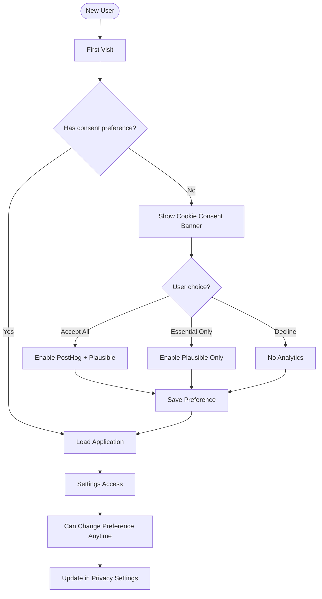
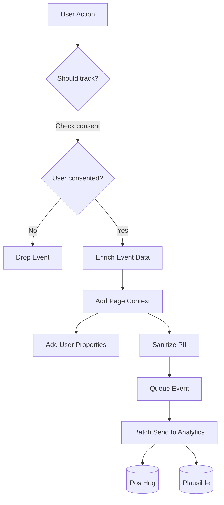
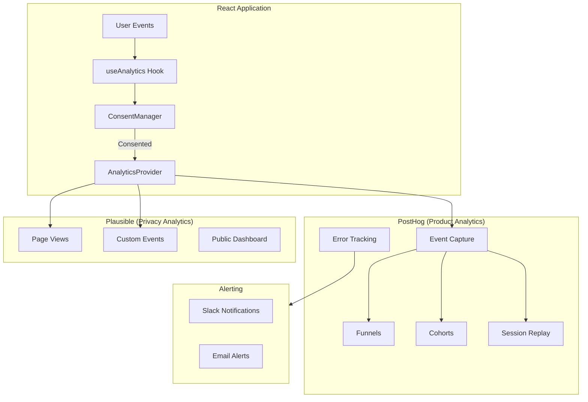

# Feature Spec: Analytics Integration (PostHog + Plausible)

**Spec ID**: PLAN-002  
**Type**: Feature Spec  
**Status**: Draft  
**Created**: Feb 8, 2026 at 9:47 AM  
**Coding Agent**: Kimi Code CLI  
**Chat Reference**: `.gemini/conversations/2026-02-08_09-16-analysis.md`  
**Related Specs**: None  
**Related Tasks**: TBD

---

## 1. Overview

### 1.1 Problem Statement
Currently, Midnight Invoice has no visibility into:
- How users interact with the application
- Which features are most/least used
- User retention and engagement patterns
- Conversion funnels (visitor → signup → invoice created)
- Error rates and performance issues

Without analytics, we're flying blind on product decisions and cannot measure the impact of new features.

### 1.2 Goals
- Track user behavior and product usage patterns
- Measure key business metrics (activation, retention, revenue)
- Monitor application errors and performance
- Respect user privacy (GDPR-compliant, no PII)
- Enable data-driven product decisions
- Set up both product analytics (PostHog) and privacy-focused analytics (Plausible)

### 1.3 Success Criteria
- [ ] 100% of user actions are trackable
- [ ] Funnel from signup → first invoice created is measurable
- [ ] Feature adoption (templates, teams, attachments) is tracked
- [ ] Page load times are monitored (< 2s average)
- [ ] Error tracking captures 95%+ of frontend errors
- [ ] Privacy: No PII sent to analytics, GDPR-compliant

---

## 2. User Stories

### 2.1 Product Manager (Me)
**As a** product owner  
**I want** to see which features users engage with most  
**So that** I can prioritize development effort

**Acceptance Criteria:**
- [ ] Dashboard showing daily/weekly/monthly active users
- [ ] Feature usage breakdown (invoices created, templates used, teams created)
- [ ] Retention cohort analysis
- [ ] Funnel visualization for key flows

### 2.2 Developer
**As a** developer  
**I want** to know when errors occur in production  
**So that** I can fix issues before users complain

**Acceptance Criteria:**
- [ ] Real-time error alerts in Slack/Discord
- [ ] Error context (user actions leading to error)
- [ ] Performance metrics (component render times, API latency)
- [ ] Source maps for stack traces

### 2.3 Privacy-Conscious User
**As a** user concerned about privacy  
**I want** to know my data isn't being sold or misused  
**So that** I feel safe using the application

**Acceptance Criteria:**
- [ ] Privacy policy clearly states what is tracked
- [ ] Option to opt-out of analytics (GDPR)
- [ ] No personally identifiable information collected
- [ ] Data retention limits (delete after X months)

---

## 3. User Flow

### 3.1 Analytics Opt-in/Opt-out Flow



### 3.2 Event Tracking Flow



---

## 4. Technical Design

### 4.1 Architecture Overview



### 4.2 Dual Analytics Strategy

| Aspect | PostHog | Plausible |
|--------|---------|-----------|
| **Purpose** | Product analytics, debugging | Privacy-focused, public stats |
| **Data** | Detailed events, session replay | Aggregated, anonymous |
| **Users** | Internal team | Public (if shared) |
| **Consent** | Requires opt-in | Can run without consent (no cookies) |
| **Features** | Funnels, cohorts, A/B testing | Simple, fast, GDPR-compliant |
| **Cost** | Free tier: 1M events/month | $9/month for 10k pageviews |

### 4.3 Data Model

#### Event Schema
```typescript
// src/lib/analytics/events.ts

interface AnalyticsEvent {
  event: string;
  properties?: Record<string, unknown>;
  timestamp?: number;
}

// Standard events
const AnalyticsEvents = {
  // User lifecycle
  USER_SIGNED_UP: 'user_signed_up',
  USER_LOGGED_IN: 'user_logged_in',
  USER_LOGGED_OUT: 'user_logged_out',
  
  // Invoice actions
  INVOICE_CREATED: 'invoice_created',
  INVOICE_UPDATED: 'invoice_updated',
  INVOICE_DELETED: 'invoice_deleted',
  INVOICE_VIEWED: 'invoice_viewed',
  INVOICE_DOWNLOADED: 'invoice_downloaded',
  
  // Feature usage
  TEMPLATE_APPLIED: 'template_applied',
  TEAM_CREATED: 'team_created',
  TEAM_JOINED: 'team_joined',
  CLIENT_ADDED: 'client_added',
  
  // Settings
  SETTINGS_CHANGED: 'settings_changed',
  LOGO_UPLOADED: 'logo_uploaded',
  
  // Errors
  ERROR_OCCURRED: 'error_occurred',
} as const;

// Event properties interfaces
interface InvoiceCreatedEvent {
  invoice_id: string;
  has_due_date: boolean;
  item_count: number;
  currency: string;
  tax_rate: number;
  team_id?: string;
  template_used?: string;
}
```

#### User Properties
```typescript
interface AnalyticsUser {
  id: string; // anonymized hash
  plan: 'free' | 'pro' | 'enterprise';
  team_count: number;
  invoice_count_all_time: number;
  created_at: string;
  // NO PII: no email, name, or address
}
```

### 4.4 Implementation

#### Analytics Provider
```typescript
// src/providers/AnalyticsProvider.tsx

import { PostHogProvider } from 'posthog-js/react';
import PlausibleProvider from 'next-plausible';

interface AnalyticsProviderProps {
  children: React.ReactNode;
}

export function AnalyticsProvider({ children }: AnalyticsProviderProps) {
  const { consent } = useConsent();
  
  return (
    <ConsentProvider>
      {/* Plausible: Always load (no cookies, privacy-safe) */}
      <PlausibleProvider
        domain="midnight-invoice.com"
        enabled={consent !== 'none'}
      >
        {/* PostHog: Only if user consented */}
        {consent === 'all' && (
          <PostHogProvider
            apiKey={import.meta.env.VITE_POSTHOG_KEY}
            options={{
              api_host: import.meta.env.VITE_POSTHOG_HOST,
              capture_pageview: false, // Manual capture
              persistence: 'memory', // No cookies for privacy
              sanitize_properties: sanitizeProperties,
            }}
          >
            {children}
          </PostHogProvider>
        )}
        {consent !== 'all' && children}
      </PlausibleProvider>
    </ConsentProvider>
  );
}
```

#### useAnalytics Hook
```typescript
// src/hooks/useAnalytics.ts

import { usePostHog } from 'posthog-js/react';
import { usePlausible } from 'next-plausible';

export function useAnalytics() {
  const posthog = usePostHog();
  const plausible = usePlausible();
  const { consent } = useConsent();
  
  const track = useCallback((
    event: string,
    properties?: Record<string, unknown>
  ) => {
    // Always track to Plausible (if consented)
    if (consent !== 'none') {
      plausible(event, { props: properties });
    }
    
    // Track to PostHog only if full consent
    if (consent === 'all' && posthog) {
      posthog.capture(event, sanitizeProperties(properties));
    }
  }, [consent, posthog, plausible]);
  
  const identify = useCallback((userId: string, properties?: object) => {
    if (consent === 'all' && posthog) {
      posthog.identify(hashUserId(userId), sanitizeProperties(properties));
    }
  }, [consent, posthog]);
  
  const pageView = useCallback((path: string) => {
    if (consent !== 'none') {
      plausible('pageview', { u: path });
    }
    if (consent === 'all' && posthog) {
      posthog.capture('$pageview', { $current_url: path });
    }
  }, [consent, posthog, plausible]);
  
  return { track, identify, pageView };
}
```

### 4.5 Event Tracking Plan

| Event | Trigger | Properties | Priority |
|-------|---------|------------|----------|
| `user_signed_up` | After successful signup | method (oauth/email), has_referral | P0 |
| `user_logged_in` | After login | method | P0 |
| `invoice_created` | Save invoice | item_count, currency, has_due_date, team_id | P0 |
| `invoice_downloaded` | PDF download | file_size_kb | P0 |
| `template_applied` | Apply template | template_id, category | P1 |
| `team_created` | Create team | initial_member_count | P1 |
| `client_added` | Add client | has_email, has_address | P1 |
| `settings_changed` | Update settings | setting_key | P2 |
| `error_occurred` | Error boundary catch | error_message, component_stack | P0 |

---

## 5. UI/UX Design

### 5.1 Consent Banner

```typescript
// src/components/analytics/ConsentBanner.tsx

// Appears on first visit, bottom of screen
// Options: "Accept All", "Essential Only", "Customize"
// Dismissible but remembers choice
```

**Design:**
- Fixed position, bottom of viewport
- Dark theme matching app
- Clear, concise copy
- Link to privacy policy
- Non-intrusive (doesn't block content)

### 5.2 Privacy Settings

```typescript
// src/components/settings/PrivacySettings.tsx

// In Settings drawer
// Toggle for analytics consent
// Show current preference
// Option to export/delete data
```

---

## 6. Implementation Plan

### Phase 1: Setup & Configuration (Week 1)

**Day 1-2: Account Setup**
- [ ] Create PostHog account
- [ ] Create Plausible account
- [ ] Configure projects and API keys
- [ ] Set up data retention policies

**Day 3-4: Basic Integration**
- [ ] Install PostHog SDK
- [ ] Install Plausible script
- [ ] Create AnalyticsProvider
- [ ] Add environment variables

**Day 5: Page View Tracking**
- [ ] Track route changes
- [ ] Test in development

### Phase 2: Event Tracking (Week 2)

**Day 1-2: Core Events**
- [ ] Track user auth events
- [ ] Track invoice CRUD operations
- [ ] Track feature usage

**Day 3-4: Advanced Events**
- [ ] Track settings changes
- [ ] Track team operations
- [ ] Track client operations

**Day 5: Error Tracking**
- [ ] Set up error boundaries
- [ ] Track API errors
- [ ] Configure alerting

### Phase 3: Privacy & Consent (Week 3)

**Day 1-2: Consent Management**
- [ ] Build ConsentBanner component
- [ ] Implement consent storage
- [ ] Wire up to analytics providers

**Day 3-4: Privacy Features**
- [ ] PII sanitization
- [ ] Data export functionality
- [ ] Privacy settings UI

**Day 5: Compliance**
- [ ] GDPR compliance check
- [ ] Privacy policy update
- [ ] Cookie policy

### Phase 4: Dashboards & Monitoring (Week 4)

- [ ] Create PostHog dashboards
- [ ] Set up funnels
- [ ] Configure alerts
- [ ] Document analytics usage

---

## 7. Tasks to Create

| Task ID | Title | Priority | Effort | Depends On | Phase |
|---------|-------|----------|--------|------------|-------|
| P4.1.1 | Set up PostHog and Plausible accounts | High | Small | - | 1 |
| P4.1.2 | Install and configure PostHog SDK | High | Small | P4.1.1 | 1 |
| P4.1.3 | Install and configure Plausible | High | Small | P4.1.1 | 1 |
| P4.1.4 | Create AnalyticsProvider component | High | Medium | P4.1.2, P4.1.3 | 1 |
| P4.2.1 | Implement useAnalytics hook | High | Medium | P4.1.4 | 2 |
| P4.2.2 | Track user authentication events | High | Small | P4.2.1 | 2 |
| P4.2.3 | Track invoice lifecycle events | High | Medium | P4.2.1 | 2 |
| P4.2.4 | Track feature usage events | Medium | Medium | P4.2.1 | 2 |
| P4.2.5 | Set up error tracking | High | Medium | P4.2.1 | 2 |
| P4.3.1 | Build ConsentBanner component | High | Medium | P4.1.4 | 3 |
| P4.3.2 | Implement consent management | High | Medium | P4.3.1 | 3 |
| P4.3.3 | Add privacy settings to Settings | Medium | Small | P4.3.2 | 3 |
| P4.3.4 | Implement PII sanitization | High | Small | P4.2.1 | 3 |
| P4.4.1 | Create PostHog dashboards | Medium | Medium | P4.2.5 | 4 |
| P4.4.2 | Configure alerting | Medium | Small | P4.4.1 | 4 |

---

## 8. Environment Variables

```bash
# PostHog
VITE_POSTHOG_KEY=phc_xxxxxxxxxxxxxxxxxxxx
VITE_POSTHOG_HOST=https://us.i.posthog.com

# Plausible (public script URL, no secret needed)
VITE_PLAUSIBLE_DOMAIN=midnight-invoice.com

# Feature flags (optional)
VITE_ANALYTICS_DEBUG=false
```

---

## 9. Privacy & Compliance

### 9.1 Data Collection Policy

| Data Type | PostHog | Plausible | Notes |
|-----------|---------|-----------|-------|
| Page views | ✅ | ✅ | URL path only |
| Event names | ✅ | ✅ | Custom events |
| Event properties | ✅ | ⚠️ Limited | No PII |
| User ID | ✅ (hashed) | ❌ | Anonymous |
| Session replay | ✅ | ❌ | Optional, consent-based |
| IP address | ❌ | ❌ | Not collected |
| Cookies | ❌ | ❌ | Memory-only storage |

### 9.2 GDPR Compliance Checklist
- [ ] Consent banner on first visit
- [ ] Granular consent options
- [ ] Easy opt-out mechanism
- [ ] Data export functionality
- [ ] Data deletion on request
- [ ] Privacy policy updated
- [ ] Data processing agreement signed

---

## 10. Risks & Mitigation

| Risk | Likelihood | Impact | Mitigation |
|------|------------|--------|------------|
| Users block analytics | Medium | Low | Plausible bypasses most blockers |
| Event quota exceeded | Low | Medium | Monitor usage, sampling if needed |
| Privacy regulation changes | Medium | Medium | Keep consent system flexible |
| Performance impact | Low | Medium | Lazy load analytics, async operations |

---

## 11. Open Questions

1. Should we use PostHog feature flags for gradual rollouts?
2. Do we need session replay (privacy implications)?
3. Should we track email open rates (invoice delivery)?
4. What's our public stats sharing policy?

---

## 12. Appendix

### 12.1 References
- [PostHog Documentation](https://posthog.com/docs)
- [Plausible Documentation](https://plausible.io/docs)
- [GDPR Compliance Guide](https://gdpr.eu/checklist/)

### 12.2 Changelog
- **2026-02-08** - Initial spec draft

---

*This spec was generated by Kimi Code CLI following the kartel-tools:spec-plan skill guidelines.*
