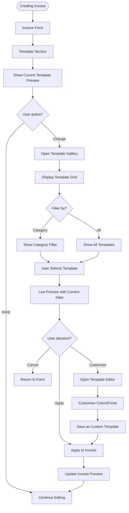
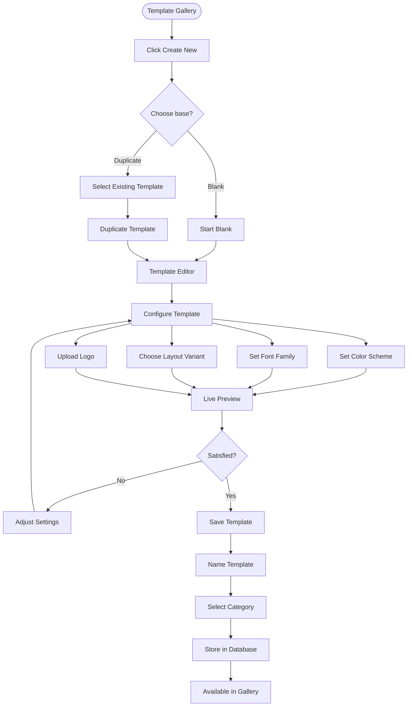
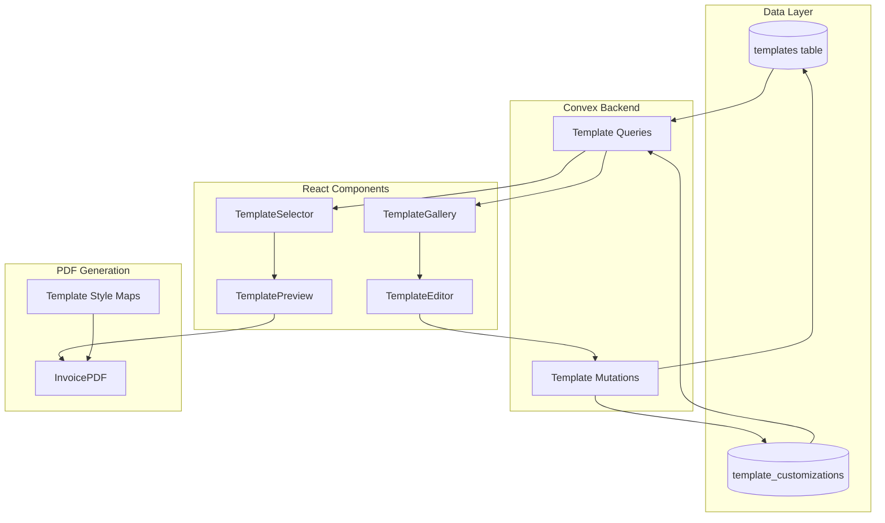

# Feature Spec: Invoice Templates System

**Spec ID**: PLAN-003  
**Type**: Feature Spec  
**Status**: Draft  
**Created**: Feb 8, 2026 at 9:48 AM  
**Coding Agent**: Kimi Code CLI  
**Chat Reference**: `.gemini/conversations/2026-02-08_09-16-analysis.md`  
**Related Specs**: PLAN-001 (File Storage for template thumbnails)  
**Related Tasks**: TBD

---

## 1. Overview

### 1.1 Problem Statement
Currently, all invoices in Midnight Invoice use the same default layout. Users cannot:
- Choose from pre-designed professional templates
- Customize colors, fonts, or layouts
- Save their own custom templates for reuse
- Apply branding consistently across multiple invoices
- Create different template styles for different clients (e.g., formal vs. creative)

This limits the professional appearance and branding flexibility of invoices.

### 1.2 Goals
- Provide a library of pre-built professional templates
- Allow users to customize template colors and fonts
- Enable saving custom templates for reuse
- Support template categories (business, creative, minimal, etc.)
- Ensure templates work across both preview and PDF generation
- Allow template preview before applying

### 1.3 Success Criteria
- [ ] 5+ pre-built templates available at launch
- [ ] Users can customize template colors
- [ ] Users can save custom templates
- [ ] Template selection is available during invoice creation
- [ ] Templates render correctly in PDF export
- [ ] Template switching preserves invoice data
- [ ] Template usage is tracked in analytics

---

## 2. User Stories

### 2.1 Freelancer
**As a** freelance designer  
**I want** to choose a modern, creative template  
**So that** my invoices reflect my design aesthetic

**Acceptance Criteria:**
- [ ] Can browse templates by category
- [ ] Can preview template with my data
- [ ] Template has modern typography and spacing
- [ ] Can customize accent color to match my brand

### 2.2 Agency Owner
**As an** agency owner  
**I want** to create a custom template with my agency branding  
**So that** all team invoices look consistent

**Acceptance Criteria:**
- [ ] Can upload logo to template
- [ ] Can set primary/secondary colors
- [ ] Can choose from multiple font pairings
- [ ] Template is shared with team members
- [ ] Can set template as default for team

### 2.3 Accountant
**As an** accountant managing multiple clients  
**I want** different templates for different client types  
**So that** invoices match each client's industry norms

**Acceptance Criteria:**
- [ ] Can create multiple custom templates
- [ ] Can name and organize templates
- [ ] Can duplicate existing templates
- [ ] Can delete unused templates

---

## 3. User Flow

### 3.1 Template Selection Flow



### 3.2 Template Creation Flow



---

## 4. Technical Design

### 4.1 Architecture Overview



### 4.2 Data Model

```typescript
// convex/schema.ts additions

export default defineSchema({
  // ... existing tables ...
  
  templates: defineTable({
    // Identity
    name: v.string(),
    description: v.optional(v.string()),
    category: v.union(
      v.literal("business"),
      v.literal("creative"),
      v.literal("minimal"),
      v.literal("modern"),
      v.literal("classic")
    ),
    
    // Ownership
    isDefault: v.boolean(), // System templates
    userId: v.optional(v.string()), // Custom templates
    teamId: v.optional(v.id("teams")), // Team templates
    
    // Template configuration
    config: v.object({
      // Colors
      primaryColor: v.string(), // hex
      secondaryColor: v.string(), // hex
      backgroundColor: v.optional(v.string()), // hex
      textColor: v.optional(v.string()), // hex
      
      // Typography
      fontFamily: v.union(
        v.literal("inter"),
        v.literal("playfair"),
        v.literal("roboto"),
        v.literal("opensans")
      ),
      headingWeight: v.optional(v.union(v.literal("normal"), v.literal("bold"))),
      
      // Layout
      layout: v.union(
        v.literal("standard"), // Logo top-left, details top-right
        v.literal("centered"), // Logo and title centered
        v.literal("sidebar"), // Sidebar with from/to info
        v.literal("minimal") // Clean, minimal header
      ),
      
      // Features
      showLogo: v.boolean(),
      showInvoiceName: v.boolean(),
      showDueDate: v.boolean(),
      showPaymentDetails: v.boolean(),
      showNotes: v.boolean(),
    }),
    
    // Assets
    thumbnailUrl: v.optional(v.string()),
    logoFileId: v.optional(v.id("files")),
    
    // Metadata
    isActive: v.boolean(),
    usageCount: v.number(),
    createdAt: v.number(),
    updatedAt: v.number(),
  })
  .index("by_category", ["category"])
  .index("by_user", ["userId"])
  .index("by_team", ["teamId"])
  .index("by_default", ["isDefault"]),
  
  // Track which template was used for each invoice
  invoices: defineTable({
    // ... existing fields ...
    templateId: v.optional(v.id("templates")),
    templateConfig: v.optional(v.object({
      // Snapshot of template config at time of creation
      primaryColor: v.string(),
      secondaryColor: v.string(),
      fontFamily: v.string(),
      layout: v.string(),
    })),
  }),
});
```

### 4.3 Template Configuration System

```typescript
// src/lib/templates/types.ts

export interface TemplateConfig {
  // Colors
  primaryColor: string;    // Brand color (buttons, links, accents)
  secondaryColor: string;  // Secondary accents
  backgroundColor?: string; // Invoice background (optional)
  textColor?: string;      // Custom text color (optional)
  
  // Typography
  fontFamily: 'inter' | 'playfair' | 'roboto' | 'opensans';
  headingWeight?: 'normal' | 'bold';
  
  // Layout
  layout: 'standard' | 'centered' | 'sidebar' | 'minimal';
  
  // Features
  showLogo: boolean;
  showInvoiceName: boolean;
  showDueDate: boolean;
  showPaymentDetails: boolean;
  showNotes: boolean;
}

export interface Template {
  id: string;
  name: string;
  description?: string;
  category: TemplateCategory;
  config: TemplateConfig;
  isDefault: boolean;
  userId?: string;
  teamId?: string;
  thumbnailUrl?: string;
  usageCount: number;
}

export type TemplateCategory = 'business' | 'creative' | 'minimal' | 'modern' | 'classic';
```

### 4.4 PDF Template Rendering

```typescript
// src/components/invoice/templates/TemplateRenderer.tsx

import { InvoiceFormData } from '@/types/invoice';
import { TemplateConfig } from '@/lib/templates/types';
import { StandardTemplate } from './StandardTemplate';
import { CenteredTemplate } from './CenteredTemplate';
import { SidebarTemplate } from './SidebarTemplate';
import { MinimalTemplate } from './MinimalTemplate';

interface TemplateRendererProps {
  data: InvoiceFormData;
  config: TemplateConfig;
  logoUrl?: string;
}

export function TemplateRenderer({ data, config, logoUrl }: TemplateRendererProps) {
  const templateProps = { data, config, logoUrl };
  
  switch (config.layout) {
    case 'centered':
      return <CenteredTemplate {...templateProps} />;
    case 'sidebar':
      return <SidebarTemplate {...templateProps} />;
    case 'minimal':
      return <MinimalTemplate {...templateProps} />;
    case 'standard':
    default:
      return <StandardTemplate {...templateProps} />;
  }
}
```

### 4.5 Style Mapping for @react-pdf/renderer

```typescript
// src/lib/templates/styles.ts

import { StyleSheet } from '@react-pdf/renderer';
import { TemplateConfig } from './types';

export function generateTemplateStyles(config: TemplateConfig) {
  return StyleSheet.create({
    page: {
      padding: 40,
      fontFamily: config.fontFamily,
      fontSize: 10,
      color: config.textColor || '#000000',
      backgroundColor: config.backgroundColor || '#ffffff',
    },
    header: {
      flexDirection: config.layout === 'centered' ? 'column' : 'row',
      alignItems: config.layout === 'centered' ? 'center' : 'flex-start',
      marginBottom: 30,
    },
    title: {
      fontSize: 24,
      fontWeight: config.headingWeight === 'bold' ? 'bold' : 'normal',
      color: config.primaryColor,
    },
    accent: {
      color: config.primaryColor,
    },
    secondaryAccent: {
      color: config.secondaryColor,
    },
    // ... more styles based on layout
  });
}

// Font registration map
export const FONT_MAP = {
  inter: { family: 'Inter', src: '/fonts/Inter-Regular.ttf' },
  playfair: { family: 'Playfair Display', src: '/fonts/PlayfairDisplay-Regular.ttf' },
  roboto: { family: 'Roboto', src: '/fonts/Roboto-Regular.ttf' },
  opensans: { family: 'Open Sans', src: '/fonts/OpenSans-Regular.ttf' },
} as const;
```

---

## 5. UI/UX Design

### 5.1 Template Gallery

```typescript
// src/components/templates/TemplateGallery.tsx

interface TemplateGalleryProps {
  selectedId?: string;
  onSelect: (template: Template) => void;
  onCustomize: (template: Template) => void;
  onCreateNew: () => void;
  category?: TemplateCategory;
}

// Features:
// - Grid of template cards
// - Thumbnail preview
// - Category filter tabs
// - Search by name
// - "Create New" button
// - Template info on hover
```

**Design Specs:**
- 3-column grid on desktop, 2 on tablet, 1 on mobile
- Card size: 280px x 360px
- Thumbnail: 280px x 200px (invoice preview)
- Selected state: Blue border, checkmark overlay
- Hover: Scale 1.02, shadow increase

### 5.2 Template Editor

```typescript
// src/components/templates/TemplateEditor.tsx

interface TemplateEditorProps {
  template?: Template; // undefined for new template
  onSave: (template: Template) => void;
  onCancel: () => void;
}

// Sections:
// 1. Live Preview (right side, sticky)
// 2. Name & Description
// 3. Color Picker (primary, secondary)
// 4. Font Selector
// 5. Layout Selector
// 6. Feature Toggles
// 7. Logo Upload
```

**Layout:**
- Two-column layout: Editor (40%) | Preview (60%)
- Preview updates in real-time
- Save/Cancel buttons sticky at bottom

### 5.3 Template Selector (Compact)

```typescript
// src/components/templates/TemplateSelector.tsx

interface TemplateSelectorProps {
  value?: string; // template ID
  onChange: (templateId: string) => void;
  teamId?: string; // for team templates
}

// Compact dropdown for invoice form
// Shows thumbnail + name
// Group by: Default, My Templates, Team Templates
```

---

## 6. Pre-built Templates

### 6.1 Template Library (MVP)

| Template | Category | Description | Colors |
|----------|----------|-------------|--------|
| **Professional** | Business | Clean, traditional business style | Navy + Gray |
| **Modern** | Modern | Contemporary with bold typography | Black + Accent |
| **Minimal** | Minimal | Ultra-clean, whitespace-focused | Black + White |
| **Creative** | Creative | Playful for designers/agencies | Purple + Pink |
| **Classic** | Classic | Timeless elegance | Forest + Cream |

### 6.2 Template Structure

```typescript
// src/lib/templates/defaults.ts

export const DEFAULT_TEMPLATES: InsertTemplate[] = [
  {
    name: 'Professional',
    description: 'Clean and traditional, perfect for business invoices',
    category: 'business',
    isDefault: true,
    config: {
      primaryColor: '#1e3a5f',
      secondaryColor: '#6b7280',
      fontFamily: 'inter',
      layout: 'standard',
      showLogo: true,
      showInvoiceName: true,
      showDueDate: true,
      showPaymentDetails: true,
      showNotes: true,
    },
  },
  {
    name: 'Modern',
    description: 'Contemporary design with bold accents',
    category: 'modern',
    isDefault: true,
    config: {
      primaryColor: '#000000',
      secondaryColor: '#3b82f6',
      fontFamily: 'inter',
      layout: 'minimal',
      showLogo: true,
      showInvoiceName: true,
      showDueDate: true,
      showPaymentDetails: true,
      showNotes: false,
    },
  },
  // ... more templates
];
```

---

## 7. Implementation Plan

### Phase 1: Data & API (Week 1)

**Day 1-2: Database**
- [ ] Add `templates` table to schema
- [ ] Add `templateId` and `templateConfig` to invoices
- [ ] Create default template seed data

**Day 3-4: Backend API**
- [ ] Create template queries (list, get by ID)
- [ ] Create template mutations (create, update, delete)
- [ ] Create template cloning function

**Day 5: Integration**
- [ ] Update invoice creation to support templates
- [ ] Test template persistence

### Phase 2: Template Renderer (Week 2)

**Day 1-2: Base Components**
- [ ] Create TemplateRenderer component
- [ ] Implement StandardTemplate
- [ ] Implement layout variants

**Day 3-4: PDF Integration**
- [ ] Update InvoicePDF to use templates
- [ ] Add font registration for template fonts
- [ ] Test PDF output for all layouts

**Day 5: Preview Component**
- [ ] Create TemplatePreview (browser preview)
- [ ] Ensure preview matches PDF output

### Phase 3: UI Components (Week 3)

**Day 1-2: Gallery**
- [ ] Build TemplateGallery component
- [ ] Add category filtering
- [ ] Add search functionality

**Day 3-4: Editor**
- [ ] Build TemplateEditor
- [ ] Implement color pickers
- [ ] Add font selector
- [ ] Add layout selector

**Day 5: Selector**
- [ ] Build compact TemplateSelector
- [ ] Integrate into InvoiceForm
- [ ] Add quick-switch functionality

### Phase 4: Polish (Week 4)

- [ ] Generate template thumbnails
- [ ] Add template usage analytics
- [ ] Optimize performance
- [ ] Add help/tooltips
- [ ] Write documentation

---

## 8. Tasks to Create

| Task ID | Title | Priority | Effort | Depends On | Phase |
|---------|-------|----------|--------|------------|-------|
| P5.1.1 | Add templates table to schema | High | Small | - | 1 |
| P5.1.2 | Add template fields to invoices | High | Small | P5.1.1 | 1 |
| P5.1.3 | Create default template seed data | High | Small | P5.1.1 | 1 |
| P5.1.4 | Implement template backend API | High | Medium | P5.1.2 | 1 |
| P5.2.1 | Create TemplateRenderer component | High | Medium | P5.1.4 | 2 |
| P5.2.2 | Implement StandardTemplate layout | High | Medium | P5.2.1 | 2 |
| P5.2.3 | Implement layout variants | Medium | Medium | P5.2.2 | 2 |
| P5.2.4 | Update InvoicePDF for templates | High | Medium | P5.2.3 | 2 |
| P5.3.1 | Build TemplateGallery component | Medium | Large | P5.2.4 | 3 |
| P5.3.2 | Build TemplateEditor component | Medium | Large | P5.2.4 | 3 |
| P5.3.3 | Build TemplateSelector component | High | Medium | P5.2.4 | 3 |
| P5.3.4 | Integrate templates into InvoiceForm | High | Medium | P5.3.3 | 3 |
| P5.4.1 | Generate template thumbnails | Low | Small | P5.3.1 | 4 |
| P5.4.2 | Add template analytics tracking | Low | Small | P5.3.4 | 4 |

---

## 9. Dependencies

### 9.1 Internal Dependencies
- PLAN-001: File Storage (for template logos)
- Existing: Invoice form and PDF generation

### 9.2 External Dependencies
- @react-pdf/renderer: Already in use
- color picker library: `react-colorful` or similar

---

## 10. Risks & Mitigation

| Risk | Likelihood | Impact | Mitigation |
|------|------------|--------|------------|
| PDF rendering differences | Medium | High | Thorough testing across templates |
| Font loading issues | Low | Medium | Pre-register fonts, fallback to default |
| Template bloat | Low | Low | Pagination, lazy loading for gallery |
| User confusion | Medium | Medium | Clear labels, preview feature |

---

## 11. Open Questions

1. Should templates support custom CSS (advanced users)?
2. Do we need template sharing between users?
3. Should we offer AI-generated template suggestions?
4. What's the limit on custom templates per user?

---

## 12. Appendix

### 12.1 References
- [React Colorful](https://omgovich.github.io/react-colorful/)
- @react-pdf/renderer documentation

### 12.2 Changelog
- **2026-02-08** - Initial spec draft

---

*This spec was generated by Kimi Code CLI following the kartel-tools:spec-plan skill guidelines.*
