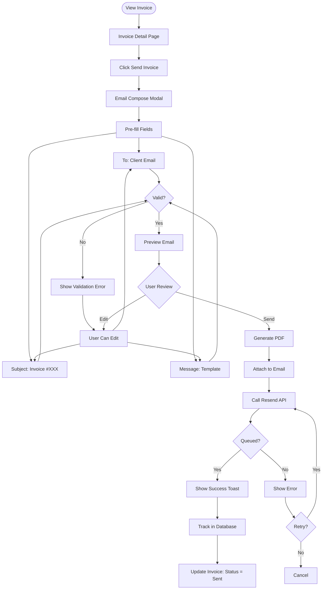
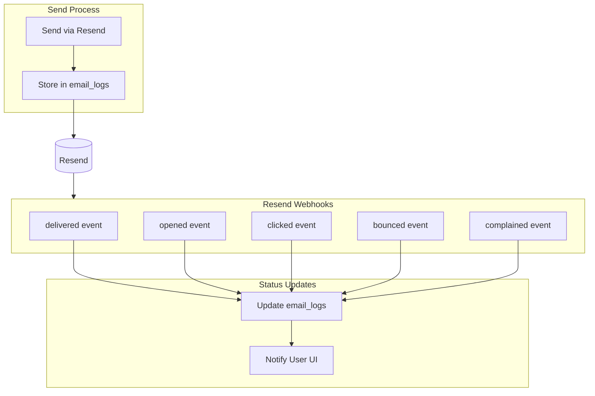
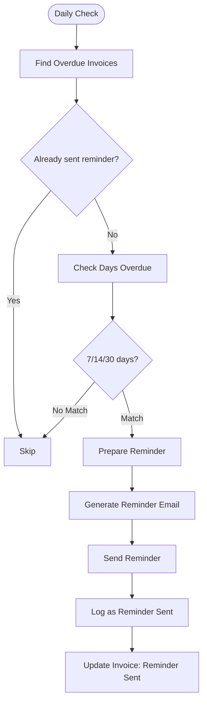
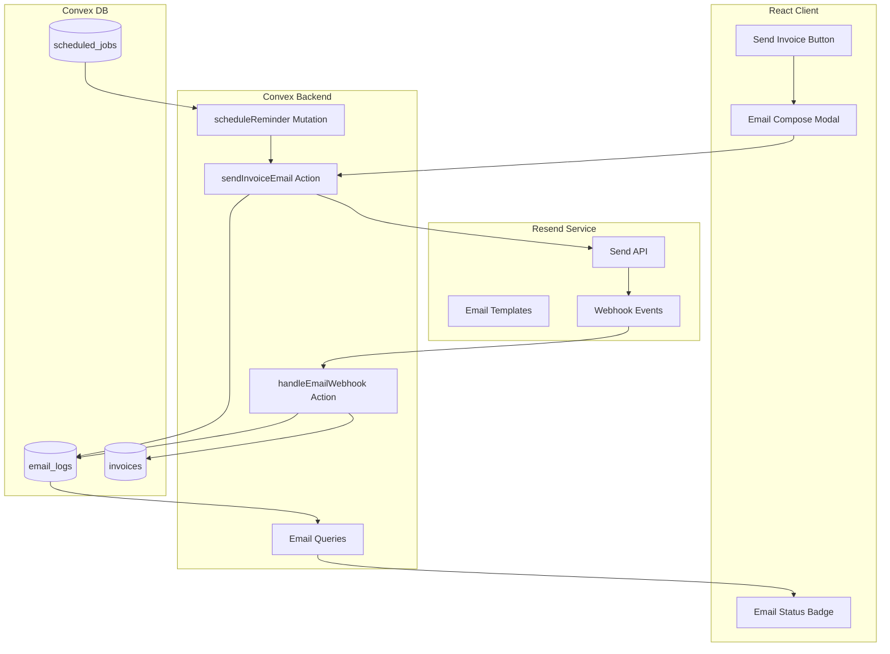

# Feature Spec: Email Delivery with Resend

**Spec ID**: PLAN-004  
**Type**: Feature Spec  
**Status**: Draft  
**Created**: Feb 8, 2026 at 9:49 AM  
**Coding Agent**: Kimi Code CLI  
**Chat Reference**: `.gemini/conversations/2026-02-08_09-16-analysis.md`  
**Related Specs**: PLAN-001 (File Storage for attachments)  
**Related Tasks**: TBD

---

## 1. Overview

### 1.1 Problem Statement
Currently, Midnight Invoice requires users to manually download PDFs and send them via their own email clients. Users cannot:
- Send invoices directly from the application
- Track if invoices were delivered/opened
- Send reminder emails for overdue invoices
- Include personalized messages with invoices
- Schedule invoices to be sent later

This creates friction in the invoicing workflow and reduces professionalism.

### 1.2 Goals
- Enable one-click invoice sending via email
- Deliver professional HTML emails with PDF attachments
- Track email delivery status (sent, delivered, opened)
- Support reminder emails for overdue invoices
- Allow custom email templates and messages
- Include invoice attachments (when file storage is enabled)
- Ensure high deliverability (avoid spam folders)

### 1.3 Success Criteria
- [ ] Users can send invoices directly from the invoice view
- [ ] Emails reach recipient inboxes (not spam) 95%+ of the time
- [ ] PDF is attached and downloadable
- [ ] Email open/click tracking is available
- [ ] Reminder emails can be scheduled for overdue invoices
- [ ] Custom message can be added to emails
- [ ] Email history is visible per invoice

---

## 2. User Stories

### 2.1 Freelancer Sending Invoice
**As a** freelancer  
**I want** to send my invoice directly from the app  
**So that** I don't have to download and email it manually

**Acceptance Criteria:**
- [ ] One-click "Send Invoice" button
- [ ] Preview email before sending
- [ ] Can add personal message
- [ ] Confirmation when email is sent
- [ ] PDF is attached automatically

### 2.2 Agency Following Up
**As an** agency owner  
**I want** to send reminder emails for overdue invoices  
**So that** I can get paid faster without manual follow-up

**Acceptance Criteria:**
- [ ] "Send Reminder" button for overdue invoices
- [ ] Reminder email template is professional but firm
- [ ] Shows payment link/details
- [ ] Tracks if reminder was opened

### 2.3 User Tracking Deliverability
**As a** user  
**I want** to know if my invoice was delivered and opened  
**So that** I can follow up appropriately

**Acceptance Criteria:**
- [ ] Email status visible (sent, delivered, opened, bounced)
- [ ] Timestamp for each status
- [ ] Open count tracking
- [ ] Bounce notifications

---

## 3. User Flow

### 3.1 Send Invoice Flow



### 3.2 Email Status Tracking Flow



### 3.3 Reminder Email Flow



---

## 4. Technical Design

### 4.1 Architecture Overview



### 4.2 Technology Choices

| Component | Choice | Rationale |
|-----------|--------|-----------|
| **Email Provider** | Resend | Excellent deliverability, generous free tier (3k/day), React Email support |
| **Email Templates** | React Email | Type-safe, component-based, renders to HTML |
| **Scheduling** | Convex Scheduler | Built-in cron jobs for reminders |
| **Webhook Handling** | Convex HTTP Actions | Native webhook endpoint support |
| **PDF Attachment** | @react-pdf/renderer | Already in use, stream to buffer |

### 4.3 Data Model

```typescript
// convex/schema.ts additions

export default defineSchema({
  // ... existing tables ...
  
  emailLogs: defineTable({
    // Relationships
    invoiceId: v.id("invoices"),
    userId: v.string(),
    teamId: v.optional(v.id("teams")),
    
    // Email details
    to: v.string(),
    subject: v.string(),
    message: v.string(),
    templateUsed: v.string(),
    
    // Resend tracking
    resendId: v.optional(v.string()),
    
    // Status tracking
    status: v.union(
      v.literal("queued"),
      v.literal("sent"),
      v.literal("delivered"),
      v.literal("opened"),
      v.literal("clicked"),
      v.literal("bounced"),
      v.literal("complained"),
      v.literal("failed")
    ),
    
    // Timestamps
    sentAt: v.number(),
    deliveredAt: v.optional(v.number()),
    openedAt: v.optional(v.number()),
    openCount: v.optional(v.number()),
    
    // Metadata
    isReminder: v.boolean(),
    ipAddress: v.optional(v.string()),
    userAgent: v.optional(v.string()),
  })
  .index("by_invoice", ["invoiceId"])
  .index("by_user", ["userId"])
  .index("by_status", ["status"])
  .index("by_resend_id", ["resendId"]),
  
  // Update invoices table
  invoices: defineTable({
    // ... existing fields ...
    emailStatus: v.optional(v.union(
      v.literal("not_sent"),
      v.literal("sent"),
      v.literal("delivered"),
      v.literal("opened")
    )),
    lastReminderSentAt: v.optional(v.number()),
    reminderCount: v.optional(v.number()),
  }),
  
  // Scheduled jobs for reminders
  scheduledReminders: defineTable({
    invoiceId: v.id("invoices"),
    scheduledFor: v.number(),
    executed: v.boolean(),
  })
  .index("by_execution", ["executed", "scheduledFor"]),
});
```

### 4.4 Email Templates (React Email)

```typescript
// src/emails/InvoiceEmail.tsx

import { Html, Head, Preview, Body, Container, Section, Text, Button } from '@react-email/components';
import { Invoice } from '@/types/invoice';

interface InvoiceEmailProps {
  invoice: Invoice;
  customMessage?: string;
  fromName: string;
  paymentLink?: string;
}

export function InvoiceEmail({ invoice, customMessage, fromName, paymentLink }: InvoiceEmailProps) {
  const total = invoice.lineItems.reduce((sum, item) => sum + item.quantity * item.price, 0) * (1 + invoice.taxRate / 100);
  
  return (
    <Html>
      <Head />
      <Preview>Invoice {invoice.invoiceNumber} from {fromName}</Preview>
      <Body style={{ backgroundColor: '#f6f9fc', fontFamily: 'sans-serif' }}>
        <Container style={{ backgroundColor: '#ffffff', margin: '0 auto', padding: '20px' }}>
          <Section>
            <Text style={{ fontSize: '24px', fontWeight: 'bold' }}>
              Invoice {invoice.invoiceNumber}
            </Text>
            
            {customMessage && (
              <Section style={{ margin: '20px 0', padding: '15px', backgroundColor: '#f9fafb', borderRadius: '8px' }}>
                <Text>{customMessage}</Text>
              </Section>
            )}
            
            <Text>Amount Due: <strong>${total.toFixed(2)} {invoice.currency}</strong></Text>
            <Text>Due Date: {invoice.dueDate || 'On Receipt'}</Text>
            
            {paymentLink && (
              <Button href={paymentLink} style={{ backgroundColor: '#000', color: '#fff', padding: '12px 24px' }}>
                Pay Invoice
              </Button>
            )}
            
            <Text style={{ fontSize: '12px', color: '#6b7280', marginTop: '30px' }}>
              Please find the detailed invoice attached as a PDF.
            </Text>
          </Section>
        </Container>
      </Body>
    </Html>
  );
}
```

### 4.5 Backend Implementation

#### Send Email Action
```typescript
// convex/emails.ts

import { Resend } from 'resend';
import { render } from '@react-email/render';

const resend = new Resend(process.env.RESEND_API_KEY);

export const sendInvoiceEmail = action({
  args: {
    invoiceId: v.id("invoices"),
    to: v.string(),
    subject: v.optional(v.string()),
    message: v.optional(v.string()),
    includePdf: v.optional(v.boolean()),
  },
  returns: v.promise(v.object({
    success: v.boolean(),
    emailLogId: v.id("emailLogs"),
    error: v.optional(v.string()),
  })),
  handler: async (ctx, args) => {
    const identity = await ctx.auth.getUserIdentity();
    if (!identity) throw new Error("Unauthenticated");
    
    // Get invoice data
    const invoice = await ctx.db.get(args.invoiceId);
    if (!invoice) throw new Error("Invoice not found");
    if (invoice.userId !== identity.tokenIdentifier) {
      throw new Error("Unauthorized");
    }
    
    // Generate PDF if needed
    let attachments;
    if (args.includePdf !== false) {
      const pdfBuffer = await generateInvoicePdf(ctx, invoice);
      attachments = [{ filename: `Invoice-${invoice.invoiceNumber}.pdf`, content: pdfBuffer }];
    }
    
    // Render email HTML
    const html = render(InvoiceEmail({
      invoice,
      customMessage: args.message,
      fromName: invoice.fromName,
    }));
    
    // Send via Resend
    const { data, error } = await resend.emails.send({
      from: 'Midnight Invoice <invoices@midnight-invoice.com>',
      to: args.to,
      subject: args.subject || `Invoice ${invoice.invoiceNumber} from ${invoice.fromName}`,
      html,
      attachments,
      tags: [{ name: 'invoice_id', value: invoice._id }],
    });
    
    // Log email
    const emailLogId = await ctx.runMutation(internal.emails.createEmailLog, {
      invoiceId: args.invoiceId,
      userId: identity.tokenIdentifier,
      to: args.to,
      subject: args.subject || `Invoice ${invoice.invoiceNumber}`,
      message: args.message || '',
      resendId: data?.id,
      status: error ? 'failed' : 'queued',
    });
    
    if (error) {
      return { success: false, emailLogId, error: error.message };
    }
    
    // Update invoice status
    await ctx.db.patch(args.invoiceId, { emailStatus: 'sent' });
    
    return { success: true, emailLogId };
  },
});
```

#### Webhook Handler
```typescript
// convex/emails.ts

export const handleWebhook = httpAction(async (ctx, request) => {
  const payload = await request.json();
  const signature = request.headers.get('x-resend-signature');
  
  // Verify webhook signature
  if (!verifyWebhookSignature(payload, signature)) {
    return new Response('Invalid signature', { status: 401 });
  }
  
  const { type, data } = payload;
  
  switch (type) {
    case 'email.delivered':
      await ctx.runMutation(internal.emails.updateEmailStatus, {
        resendId: data.id,
        status: 'delivered',
        deliveredAt: Date.now(),
      });
      break;
      
    case 'email.opened':
      await ctx.runMutation(internal.emails.updateEmailStatus, {
        resendId: data.id,
        status: 'opened',
        openedAt: Date.now(),
        incrementOpen: true,
      });
      break;
      
    case 'email.bounced':
      await ctx.runMutation(internal.emails.updateEmailStatus, {
        resendId: data.id,
        status: 'bounced',
      });
      break;
  }
  
  return new Response('OK', { status: 200 });
});
```

---

## 5. UI/UX Design

### 5.1 Send Email Modal

```typescript
// src/components/emails/SendEmailModal.tsx

interface SendEmailModalProps {
  invoice: Invoice;
  isOpen: boolean;
  onClose: () => void;
  onSend: (data: EmailData) => Promise<void>;
}

interface EmailData {
  to: string;
  subject: string;
  message: string;
  includePdf: boolean;
}

// Sections:
// 1. Recipient (pre-filled with client email)
// 2. Subject (editable)
// 3. Message (textarea for custom message)
// 4. PDF attachment toggle
// 5. Preview toggle (show HTML preview)
// 6. Send button with loading state
```

**Design:**
- Modal size: 600px max-width
- Real-time preview of email
- Character count for message
- Send button prominently displayed
- Close/Cancel option

### 5.2 Email Status Component

```typescript
// src/components/emails/EmailStatusBadge.tsx

interface EmailStatusBadgeProps {
  status: EmailStatus;
  sentAt?: Date;
  deliveredAt?: Date;
  openedAt?: Date;
  openCount?: number;
}

// Visual indicators:
// - Not sent: Gray "Send Invoice" button
// - Sent: Blue "Sent" badge
// - Delivered: Green checkmark
// - Opened: Eye icon with count
```

**Status Icons:**
| Status | Icon | Color |
|--------|------|-------|
| not_sent | Paper airplane | Gray |
| sent | Check | Blue |
| delivered | Double check | Green |
| opened | Eye | Purple |
| bounced | X | Red |

### 5.3 Email History

```typescript
// src/components/emails/EmailHistory.tsx

interface EmailHistoryProps {
  invoiceId: string;
}

// Timeline of all emails sent for an invoice
// Shows: sent date, status, recipient, reminder indicator
```

---

## 6. Implementation Plan

### Phase 1: Setup & Configuration (Week 1)

**Day 1-2: Resend Setup**
- [ ] Create Resend account
- [ ] Verify domain (midnight-invoice.com)
- [ ] Configure DNS records (SPF, DKIM, DMARC)
- [ ] Get API keys

**Day 3-4: Database Schema**
- [ ] Add emailLogs table
- [ ] Add email fields to invoices
- [ ] Add scheduledReminders table

**Day 5: Backend Foundation**
- [ ] Install Resend SDK
- [ ] Install React Email
- [ ] Create email rendering utility

### Phase 2: Email Templates (Week 2)

**Day 1-2: Template Development**
- [ ] Create InvoiceEmail template
- [ ] Create ReminderEmail template
- [ ] Style for major email clients
- [ ] Test rendering

**Day 3-4: Send Functionality**
- [ ] Implement sendInvoiceEmail action
- [ ] Implement PDF generation for attachment
- [ ] Test email delivery

**Day 5: Webhook Integration**
- [ ] Set up webhook endpoint
- [ ] Handle delivery events
- [ ] Update email status in database

### Phase 3: Frontend (Week 3)

**Day 1-2: Send Modal**
- [ ] Build SendEmailModal component
- [ ] Add email preview
- [ ] Add form validation

**Day 3-4: Status & History**
- [ ] Build EmailStatusBadge
- [ ] Build EmailHistory component
- [ ] Integrate into Invoice view

**Day 5: Reminders**
- [ ] Build reminder scheduling
- [ ] Create reminder UI
- [ ] Test reminder flow

### Phase 4: Optimization (Week 4)

- [ ] Email deliverability testing
- [ ] Spam score checking
- [ ] Rate limiting implementation
- [ ] Documentation

---

## 7. Tasks to Create

| Task ID | Title | Priority | Effort | Depends On | Phase |
|---------|-------|----------|--------|------------|-------|
| P6.1.1 | Set up Resend account and domain | High | Small | - | 1 |
| P6.1.2 | Configure DNS for email deliverability | High | Small | P6.1.1 | 1 |
| P6.1.3 | Add email_logs table to schema | High | Small | P6.1.1 | 1 |
| P6.1.4 | Install Resend SDK and React Email | High | Small | P6.1.1 | 1 |
| P6.2.1 | Create InvoiceEmail template | High | Medium | P6.1.4 | 2 |
| P6.2.2 | Create ReminderEmail template | Medium | Medium | P6.1.4 | 2 |
| P6.2.3 | Implement sendInvoiceEmail action | High | Medium | P6.2.1 | 2 |
| P6.2.4 | Set up Resend webhook handler | High | Medium | P6.2.3 | 2 |
| P6.3.1 | Build SendEmailModal component | High | Medium | P6.2.3 | 3 |
| P6.3.2 | Build EmailStatusBadge component | High | Small | P6.2.4 | 3 |
| P6.3.3 | Build EmailHistory component | Medium | Small | P6.3.2 | 3 |
| P6.3.4 | Integrate email sending into invoice view | High | Small | P6.3.1 | 3 |
| P6.4.1 | Implement reminder scheduling | Medium | Medium | P6.3.4 | 4 |
| P6.4.2 | Add email deliverability monitoring | Low | Small | P6.4.1 | 4 |

---

## 8. Environment Variables

```bash
# Resend
RESEND_API_KEY=re_xxxxxxxxxxxxxxxxxxxxxxxxxxxx
RESEND_WEBHOOK_SECRET=whsec_xxxxxxxxxxxxxxxxxxxx

# Domain (for sending)
EMAIL_FROM_DOMAIN=midnight-invoice.com
EMAIL_FROM_NAME=Midnight Invoice

# Optional: for payment links in emails
VITE_PAYMENT_LINK_BASE_URL=https://pay.midnight-invoice.com
```

---

## 9. Email Deliverability Checklist

### 9.1 DNS Records Required

| Record Type | Host | Value | Purpose |
|-------------|------|-------|---------|
| SPF | @ | `v=spf1 include:_spf.resend.com ~all` | Authorize Resend |
| DKIM | resend._domainkey | [from Resend] | Email signing |
| DMARC | _dmarc | `v=DMARC1; p=quarantine; rua=mailto:dmarc@midnight-invoice.com` | Policy enforcement |

### 9.2 Best Practices
- [ ] Warm up domain (start with small volume)
- [ ] Use consistent "From" name and address
- [ ] Include unsubscribe link (for marketing)
- [ ] Keep email size under 100KB
- [ ] Test with Mail Tester before launch

---

## 10. Risks & Mitigation

| Risk | Likelihood | Impact | Mitigation |
|------|------------|--------|------------|
| Emails land in spam | Medium | High | Proper DNS setup, gradual warm-up |
| Resend rate limits | Low | Medium | Implement rate limiting, queue system |
| PDF generation fails | Low | High | Error handling, retry logic |
| Webhook delivery issues | Low | Low | Idempotent handlers, retry logic |

---

## 11. Open Questions

1. Should we support multiple recipients (CC/BCC)?
2. Do we need email scheduling (send later)?
3. Should we integrate with payment providers (Stripe) for payment links?
4. Do we need email template customization per user?

---

## 12. Appendix

### 12.1 References
- [Resend Documentation](https://resend.com/docs)
- [React Email](https://react.email/)
- [Email Deliverability Guide](https://resend.com/docs/dashboard/domains/introduction)

### 12.2 Changelog
- **2026-02-08** - Initial spec draft

---

*This spec was generated by Kimi Code CLI following the kartel-tools:spec-plan skill guidelines.*
