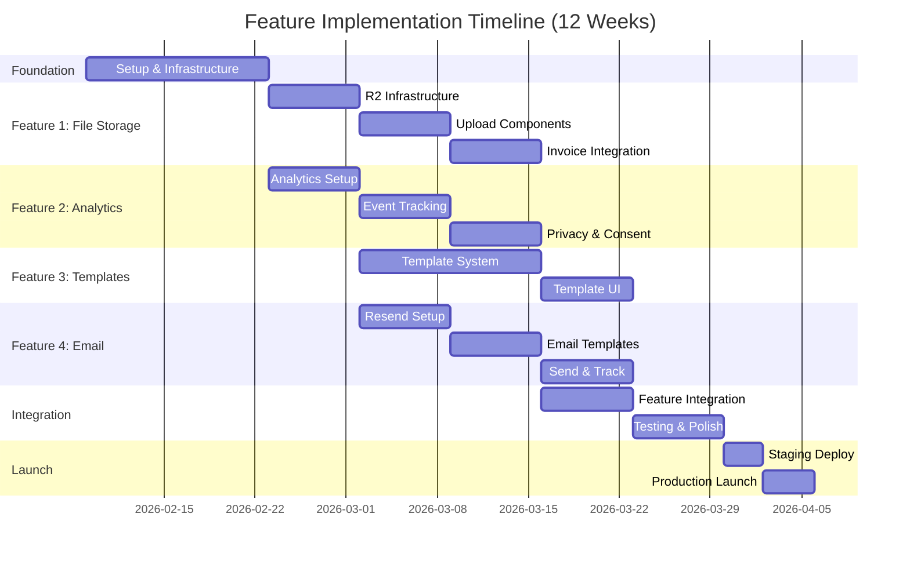
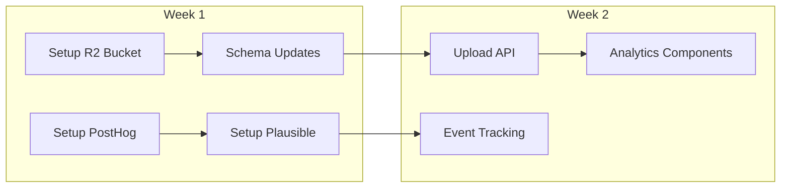
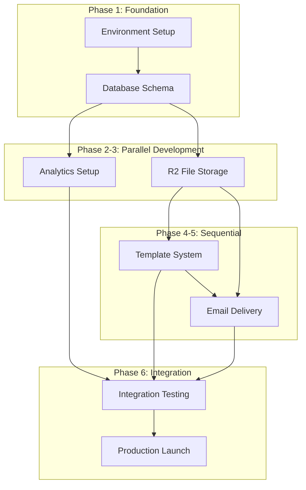
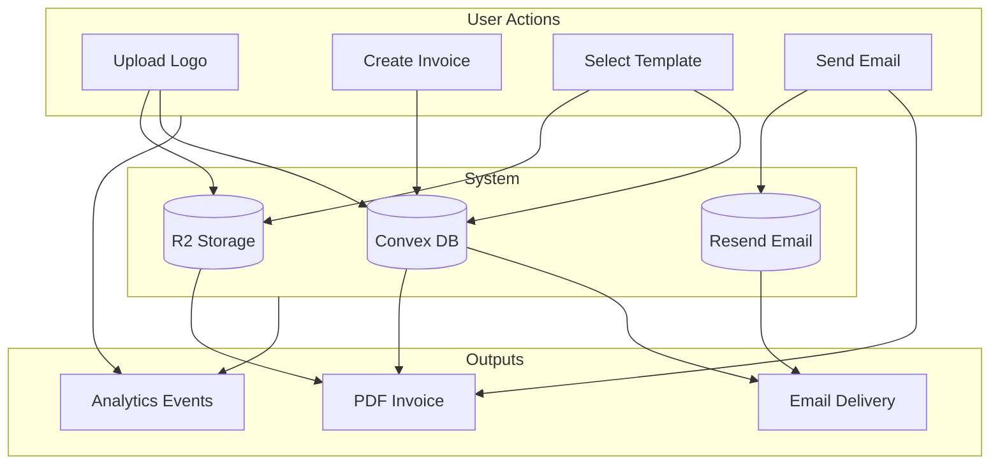

# Implementation Roadmap: Feature Suite Q1 2026

**Roadmap ID**: ROADMAP-001  
**Type**: Master Implementation Roadmap  
**Status**: Draft  
**Created**: Feb 8, 2026 at 9:51 AM  
**Coding Agent**: Kimi Code CLI  
**Chat Reference**: `.gemini/conversations/2026-02-08_09-16-analysis.md`  
**Related Specs**: 
- PLAN-001: Cloudflare R2 File Storage
- PLAN-002: Analytics Integration
- PLAN-003: Invoice Templates
- PLAN-004: Resend Email Delivery

---

## 1. Executive Summary

This roadmap outlines the implementation strategy for four major features to elevate Midnight Invoice from a basic invoice generator to a professional business tool. The features are designed to work together synergistically:

- **File Storage** enables logos and attachments
- **Templates** leverage logos for branded invoices  
- **Email** delivers invoices with attachments
- **Analytics** tracks usage across all features

### Timeline Overview



---

## 2. Strategic Prioritization

### 2.1 Priority Matrix

| Feature | User Impact | Technical Complexity | Business Value | Priority |
|---------|-------------|---------------------|----------------|----------|
| **File Storage** | High | Medium | High | P0 |
| **Analytics** | Medium | Low | High | P0 |
| **Templates** | High | High | High | P1 |
| **Email Delivery** | Very High | Medium | Very High | P1 |

### 2.2 Implementation Order Rationale

**Phase 1: Foundation (Weeks 1-2)**
- File Storage first → enables logos for Templates
- Analytics parallel → tracks all subsequent features

**Phase 2: Core Features (Weeks 3-8)**
- Templates leverage File Storage (logos)
- Email delivers Templates as PDFs

**Phase 3: Integration (Weeks 9-12)**
- All features working together
- Comprehensive testing

---

## 3. Phase Breakdown

### Phase 1: Foundation (Weeks 1-2)

**Goal**: Set up infrastructure that subsequent features depend on



**Deliverables:**
- ✅ Cloudflare R2 bucket configured
- ✅ File upload API functional
- ✅ Analytics providers receiving data
- ✅ Consent banner implemented

**Cross-Cutting Tasks:**
| Task ID | Title | Owner | Effort |
|---------|-------|-------|--------|
| R1.1 | Environment setup (all services) | DevOps | 1 day |
| R1.2 | Database schema migration | Backend | 2 days |
| R1.3 | CI/CD pipeline updates | DevOps | 1 day |

---

### Phase 2: File Storage (Weeks 3-5)

**Goal**: Enable file uploads for logos and attachments

**Dependencies**: Phase 1 complete

**Week 3: Backend**
- R2 integration
- Presigned URL generation
- File validation & security

**Week 4: Frontend Components**
- Logo upload in Settings
- File dropzone component
- Progress indicators

**Week 5: Invoice Integration**
- Logo in PDF rendering
- Invoice attachments
- File management UI

**Integration Points:**
```
File Storage ──► Templates (logos)
            ──► Email (attachments)
```

---

### Phase 3: Analytics (Weeks 3-5, Parallel)

**Goal**: Track user behavior and system health

**Dependencies**: Phase 1 complete

**Week 3: Setup**
- PostHog/Plausible configuration
- Page view tracking
- User identification

**Week 4: Event Tracking**
- Invoice lifecycle events
- Feature usage tracking
- Error tracking

**Week 5: Privacy & Dashboards**
- Consent management
- PII sanitization
- Dashboard creation

**Tracking Coverage:**
```
All Features ──► Analytics
```

---

### Phase 4: Templates (Weeks 6-9)

**Goal**: Professional, customizable invoice designs

**Dependencies**: File Storage (Week 3-5)

**Week 6-7: Template System**
- Database schema
- Template renderer
- 5 default templates

**Week 8: Template UI**
- Gallery component
- Editor interface
- Preview system

**Week 9: Integration**
- Template selector in invoice form
- Logo integration
- Settings integration

**Template Categories:**
| Category | Use Case | Base Colors |
|----------|----------|-------------|
| Business | Corporate, traditional | Navy/Gray |
| Modern | Tech, startups | Black/Blue |
| Minimal | Freelancers, simple | Black/White |
| Creative | Designers, agencies | Purple/Pink |
| Classic | Law, finance | Forest/Cream |

---

### Phase 5: Email Delivery (Weeks 7-10)

**Goal**: One-click invoice sending with tracking

**Dependencies**: Templates (Week 6-9)

**Week 7: Resend Setup**
- Domain verification
- DNS configuration
- Webhook endpoints

**Week 8-9: Email System**
- React Email templates
- PDF attachment generation
- Send API integration

**Week 10: Tracking & Reminders**
- Webhook handling
- Status tracking UI
- Reminder scheduling

**Email Flow:**
```
Invoice + Template ──► PDF Generation ──► Email with Attachment
                                     ──► Tracking
```

---

### Phase 6: Integration & Polish (Weeks 11-12)

**Goal**: All features working seamlessly together

**Week 11: Integration Testing**
- End-to-end workflows
- Cross-feature scenarios
- Performance testing

**Week 12: Launch Preparation**
- Staging deployment
- Documentation
- Production launch

---

## 4. Dependency Graph



---

## 5. Resource Allocation

### 5.1 Development Team Assumptions

| Role | Allocation | Responsibilities |
|------|------------|------------------|
| Full-Stack Dev 1 | 100% | File Storage, Email |
| Full-Stack Dev 2 | 100% | Analytics, Templates |
| DevOps | 25% | Infrastructure, CI/CD |
| QA | 50% (Weeks 10-12) | Testing |

### 5.2 Weekly Capacity

```
Weeks 1-9:  2 devs × 5 days = 10 dev-days/week
Weeks 10-12: 2 devs + 0.5 QA = 12.5 dev-days/week
```

### 5.3 Risk Mitigation

| Risk | Impact | Mitigation |
|------|--------|------------|
| Developer unavailable | High | Parallel work streams, documentation |
| Integration issues | Medium | Weekly integration checks |
| Scope creep | Medium | Strict phase gates |
| Third-party delays | Low | Early account setup |

---

## 6. Feature Integration Points

### 6.1 Data Flow Diagram



### 6.2 Key Integration Scenarios

#### Scenario 1: New Invoice with Template
```
1. User selects template → Template applied with config
2. Template includes logo → Logo fetched from R2
3. User saves invoice → Invoice data stored
4. Analytics tracks → template_applied event
```

#### Scenario 2: Send Invoice Email
```
1. User clicks Send → Modal opens with preview
2. Include attachments? → Fetch from R2 if yes
3. Generate PDF → Use template + logo
4. Send via Resend → Email with PDF attachment
5. Track status → Webhook updates status
6. Analytics tracks → invoice_sent event
```

#### Scenario 3: Overdue Reminder
```
1. Cron job checks → Finds overdue invoices
2. Generate reminder → Using invoice data
3. Send email → Via Resend
4. Update invoice → reminder_sent flag
5. Track event → reminder_sent analytics
```

---

## 7. Technical Architecture Overview

### 7.1 New Components Overview

```
src/
├── components/
│   ├── files/
│   │   ├── LogoUpload.tsx
│   │   ├── FileDropzone.tsx
│   │   └── AttachmentList.tsx
│   ├── analytics/
│   │   ├── ConsentBanner.tsx
│   │   └── AnalyticsProvider.tsx
│   ├── templates/
│   │   ├── TemplateGallery.tsx
│   │   ├── TemplateEditor.tsx
│   │   └── TemplateSelector.tsx
│   └── emails/
│       ├── SendEmailModal.tsx
│       ├── EmailStatusBadge.tsx
│       └── EmailHistory.tsx
├── hooks/
│   ├── useFileUpload.ts
│   ├── useAnalytics.ts
│   └── useTemplates.ts
├── lib/
│   ├── templates/
│   │   ├── types.ts
│   │   ├── defaults.ts
│   │   └── styles.ts
│   └── analytics/
│       ├── events.ts
│       └── provider.tsx
└── emails/  # React Email templates
    ├── InvoiceEmail.tsx
    └── ReminderEmail.tsx
```

### 7.2 Convex Functions Overview

```
convex/
├── files.ts          # File upload/management
├── templates.ts      # Template CRUD
├── emails.ts         # Email sending & webhooks
├── analytics.ts      # Analytics aggregation
├── schema.ts         # Updated schema
└── cron.ts           # Reminder scheduling
```

---

## 8. Testing Strategy

### 8.1 Testing Phases

| Phase | Type | Coverage | Responsible |
|-------|------|----------|-------------|
| Unit | Component/hook tests | 70%+ | Developers |
| Integration | Feature interaction | Critical paths | Developers |
| E2E | Full user workflows | 5 core flows | QA |
| Performance | Load testing | Email, upload | DevOps |

### 8.2 Critical Test Scenarios

1. **Upload Flow**: Select file → Validate → Upload → Preview → Save reference
2. **Template Flow**: Select template → Customize → Apply → Generate PDF
3. **Email Flow**: Compose → Generate PDF → Attach → Send → Track status
4. **Reminder Flow**: Overdue detected → Reminder sent → Status updated
5. **Analytics Flow**: Event triggered → Sanitized → Logged → Dashboard visible

---

## 9. Success Metrics

### 9.1 Feature Adoption

| Metric | Target | Measurement |
|--------|--------|-------------|
| Logo upload rate | 60% of users | Users with logo / Total users |
| Template usage | 80% of invoices | Template invoices / Total |
| Email send rate | 70% of invoices | Sent via app / Total |
| Analytics coverage | 100% of events | Tracked events / All events |

### 9.2 Technical Metrics

| Metric | Target | Measurement |
|--------|--------|-------------|
| Email deliverability | >95% | Delivered / Sent |
| Upload success rate | >99% | Successful / Attempted |
| PDF generation | <2s | Average time |
| Page load impact | <100ms | With analytics |

### 9.3 Business Metrics

| Metric | Target | Measurement |
|--------|--------|-------------|
| User activation | +30% | Invoice created / Signed up |
| User retention | +20% | 7-day retention |
| NPS score | >50 | User survey |

---

## 10. Launch Checklist

### 10.1 Pre-Launch (Week 11)

- [ ] All features integrated and tested
- [ ] Performance benchmarks met
- [ ] Security review completed
- [ ] Documentation updated
- [ ] Monitoring & alerting configured

### 10.2 Launch Week (Week 12)

- [ ] Staging deployment smoke tests pass
- [ ] Production deployment
- [ ] Feature flags enabled gradually
- [ ] Monitor error rates
- [ ] Support team briefed

### 10.3 Post-Launch

- [ ] Daily metrics review (first week)
- [ ] User feedback collection
- [ ] Bug fix prioritization
- [ ] Iteration planning

---

## 11. Appendix

### 11.1 Task Reference Matrix

| Spec | Task Prefix | Task Count |
|------|-------------|------------|
| PLAN-001 | P3.x | 13 tasks |
| PLAN-002 | P4.x | 14 tasks |
| PLAN-003 | P5.x | 13 tasks |
| PLAN-004 | P6.x | 14 tasks |
| **Total** | | **54 tasks** |

### 11.2 External Service Setup Checklist

**Cloudflare R2**
- [ ] Account created
- [ ] Bucket created: `midnight-invoice-files`
- [ ] CORS configured
- [ ] API tokens generated

**PostHog**
- [ ] Account created
- [ ] Project configured
- [ ] API keys generated
- [ ] Dashboard templates imported

**Plausible**
- [ ] Account created
- [ ] Site added
- [ ] Script installed

**Resend**
- [ ] Account created
- [ ] Domain verified
- [ ] DNS records configured
- [ ] API key generated
- [ ] Webhook endpoint configured

### 11.3 Changelog

- **2026-02-08** - Initial roadmap draft

---

## 12. Quick Reference

### Timeline at a Glance

| Week | Focus | Key Deliverables |
|------|-------|------------------|
| 1-2 | Foundation | R2, PostHog, schema ready |
| 3-5 | File Storage | Upload, logos in PDF |
| 3-5 | Analytics | Tracking live |
| 6-9 | Templates | 5 templates, editor |
| 7-10 | Email | Send, track, remind |
| 11-12 | Integration | Test, launch |

### Dependency Quick View

```
Start ──► Foundation ──┬──► File Storage ──► Templates ──► Email
                       └──► Analytics (parallel)
```

---

*This roadmap was generated by Kimi Code CLI following the kartel-tools:spec-plan skill guidelines.*
